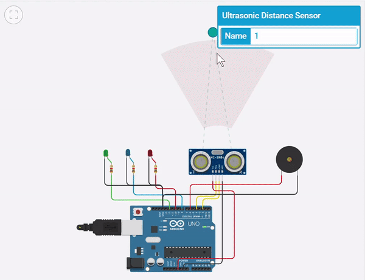

Social Distancing Alert Assistant
=============

## Description
An arduino project to alert the user if someone is within the prescribed social distancing distance.  
The device glows different leds to indicate the distance from the other person and sounds a buzzer if the 80cm mark is crossed.

<!-- ## Dependencies:
## Contents
## Execution -->

