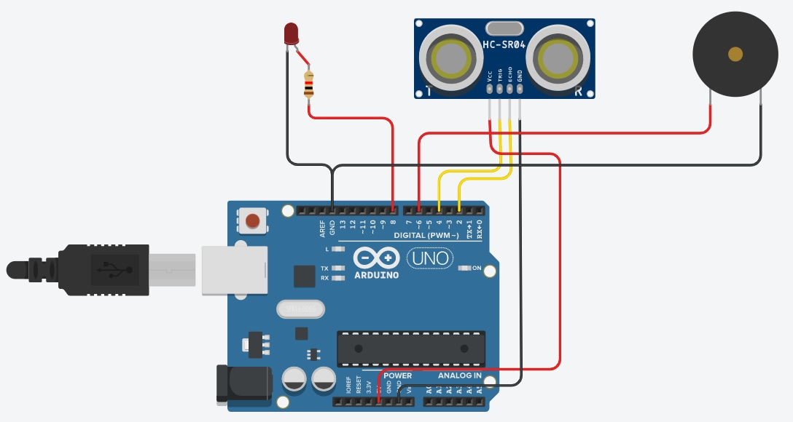

Social Distancing Alert Assistant
=============

## Description
An arduino created social distancing alert assistant that signals a variety of alarms depending on whether a person is too close to the user.

## Components required
* Arduino Nano board
* 1 Resistor
* 1 LED
* Robocraze active buzzer
* HC SR04 Ultrasonic sensor
* 1 9V battery
* Breadboard and jumper cables

## Software requirements
* [Arduino IDE](https://www.arduino.cc/en/software)

## Circuit

## Execution
1. Connect the components as shown in the above circuit.
2. Using Arduino IDE, upload the code from 'code' file.
3. Power the device using the 9V battery.

