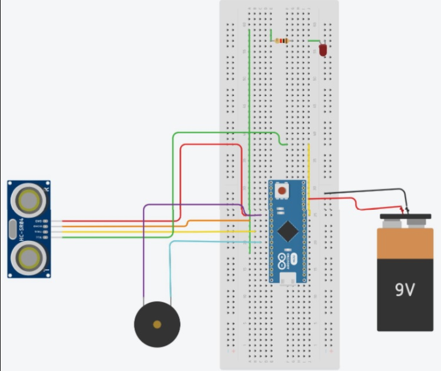

Social Distancing Alert Assistant
=============

## Description
Arduino-powered social distancing alert assistant to signal with a variety of alarms depending on the user’s proximity to others.

## Components required
* Arduino Nano board
* 1 Resistor
* 1 LED
* Robocraze active buzzer
* HC SR04 Ultrasonic sensor
* 1 9V battery
* Breadboard and jumper cables

## Software requirements
* [Arduino IDE](https://www.arduino.cc/en/software)

## Usage
1. Connect the components as shown in the circuit below.
2. Using Arduino IDE, upload the code from `code` to Arduino Nano board.
3. Power the device using the 9V battery.

## Circuit

## Project Demo

